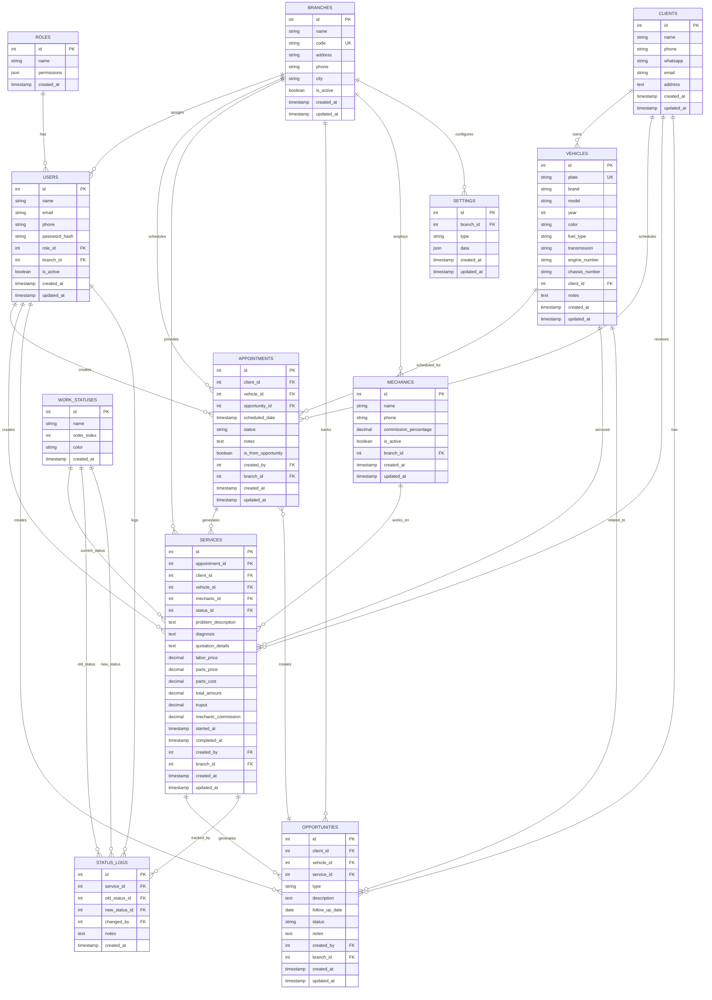

# Especificación Técnica Completa - App Henry Diagnostics

## 1. Información General
- **Nombre del Taller:** Henry Diagnostics
- **Tipo de Sistema:** Aplicación web responsiva para gestión integral de taller mecánico
- **Plataformas:** 
  - Desktop/Tablet: Operación completa del taller
  - Móvil: Consulta de status para propietarios
- **Estado Actual:** ✅ Sistema 100% funcional con multi-taller implementado

## 2. Flujo de Operaciones Implementado ✅

### Proceso Principal:
1. **Cita Telefónica** - Se captura información básica del cliente
2. **Recepción del Vehículo** - Se completan datos y se marca como recibido
3. **Diagnóstico** - Mecánico evalúa el vehículo
4. **Cotización** - Se genera y envía por WhatsApp
5. **Autorización** - Cliente aprueba el trabajo
6. **Proceso de Trabajo** - Ejecución de reparaciones
7. **Finalización y Cobro** - Se termina y cobra el trabajo
8. **Creación de Oportunidades** - Para trabajos futuros/recurrentes (con todos los datos completos)
9. **Seguimiento** - Una semana antes de fecha pactada
10. **Nueva Cita desde Oportunidad** - Con datos pre-cargados, salto directo al paso 2

### Flujos de Citas:
**Flujo A - Cita Nueva (telefónica):**
- Información mínima: cliente, vehículo (marca/modelo), teléfono, fecha
- Al llegar: se completan datos del vehículo (placa) y proceso normal

**Flujo B - Cita desde Oportunidad:**
- Todos los datos ya disponibles (cliente, vehículo completo con placa)
- Al llegar: directo a "Recibido" sin captura adicional de datos
- Referencia a la oportunidad origen

## 3. Módulos del Sistema ✅ COMPLETADOS

### 3.1 Módulo de Usuarios y Roles ✅ IMPLEMENTADO
- **ADMIN:** Gestión completa de usuarios, roles, sucursales y configuración
- **RECEPCIONISTA:** Dashboard, citas, clientes, vehículos, servicios y oportunidades
- **MECANICO:** Solo lectura para consultas básicas
- **Sistema de permisos granular:** Implementado con PermissionGate
- **Multi-sucursal:** Segregación automática por branchId en JWT

### 3.2 Módulo de Citas ✅ IMPLEMENTADO + OPTIMIZACIÓN MÓVIL COMPLETA
**Funcionalidades implementadas:**
- ✅ Citas nuevas (telefónicas) con información básica
- ✅ Citas desde oportunidades con datos pre-cargados
- ✅ Calendario diario (8:00 AM - 7:00 PM) y vista mensual
- ✅ Creación de vehículos inline desde modal de citas
- ✅ Vista mensual muestra vehículo (marca+modelo) en lugar de cliente
- ✅ Integración completa con workflow de servicios
- ✅ **NUEVO: Interfaz móvil adaptativa completa**

**Optimización Móvil (2025-09-28):**
- ✅ **Auto-detección dispositivo**: Hook `useIsMobile()` detecta automáticamente móviles (< 768px)
- ✅ **Vista por defecto adaptativa**: Lista en móvil vs Semana en desktop
- ✅ **Componentes móviles específicos**:
  - `MobileAppointmentCard.tsx`: Cards expandibles con información jerárquizada
  - `MobileNavigation.tsx`: Navegación simplificada (Lista/Hoy/Mes)
  - `MobileAppointmentsList.tsx`: Lista optimizada con pull-to-refresh
- ✅ **Funcionalidades táctiles**:
  - Pull-to-refresh nativo para actualizar datos
  - Cards expandibles con tap (información esencial + detalles)
  - Enlaces directos para llamadas telefónicas (tel:)
  - Botones grandes optimizados para dedos
- ✅ **Acciones rápidas móviles**:
  - Confirmar/Cancelar/Recibir Auto directamente desde cards
  - WhatsApp integrado con recordatorios en cada card
  - Paginación táctil con botones grandes
- ✅ **Experiencia unificada**: Misma funcionalidad adaptada por dispositivo
- ✅ **Performance optimizada**: Componentes ligeros específicos para móvil
- ✅ **Integración WhatsApp móvil**: Acceso rápido a recordatorios desde cards

### 3.3 Módulo de Clientes ✅ IMPLEMENTADO
**Funcionalidades implementadas:**
- ✅ CRUD completo de clientes
- ✅ Frontend-Only Filtering (búsqueda sin pérdida de foco)
- ✅ Información: nombre, teléfono, WhatsApp, email, dirección
- ✅ Historial completo de servicios por cliente
- ✅ Paginación local con límite 1000 registros
- ✅ Permisos granulares por rol de usuario

### 3.4 Módulo de Vehículos ✅ IMPLEMENTADO
**Funcionalidades implementadas:**
- ✅ CRUD completo de vehículos
- ✅ Frontend-Only Filtering (búsqueda sin pérdida de foco)
- ✅ Campos: placa, marca, modelo, año, color, tipo combustible, transmisión
- ✅ Campos técnicos: número motor, número chasis
- ✅ Cliente propietario con relación cascada
- ✅ Historial completo de servicios
- ✅ Notas especiales por vehículo
- ✅ **GLOBAL:** Vehículos disponibles en todas las sucursales

### 3.5 Módulo de Servicios/Trabajos ✅ IMPLEMENTADO
**Funcionalidades implementadas:**
- ✅ CRUD completo de servicios
- ✅ Sistema de estados con workflow: Recibido → Cotizado → Autorizado → En Proceso → Terminado
- ✅ Vista Kanban con drag & drop entre estados
- ✅ Sistema de pricing completo: labor_price, parts_price, parts_cost, total_amount, truput
- ✅ Mecánico asignado con cálculo automático de comisiones
- ✅ Problema, diagnóstico, cotización detallada
- ✅ Timestamps automáticos (started_at, completed_at)
- ✅ Logs de auditoría de cambios de estado
- ✅ Segregación por sucursal (branchId)
- ✅ **Integración con citas:** Creación de servicios desde citas confirmadas
- ✅ **Edición de vehículos inline:** Campos editables en formulario de servicios desde citas
- ✅ **Precarga automática:** Campo automóvil se precarga correctamente en edición
- ✅ **Actualización de datos:** Auto-actualización de vehículo al crear servicio desde cita

### 3.6 Módulo de Búsqueda y Consultas ✅ IMPLEMENTADO
**Funcionalidades implementadas:**
- ✅ Frontend-Only Filtering en clientes y vehículos
- ✅ Búsqueda por nombre de cliente
- ✅ Búsqueda por placa de vehículo
- ✅ Búsqueda por marca/modelo del vehículo
- ✅ Búsqueda por teléfono del cliente
- ✅ Filtros por fecha de servicio en dashboard
- ✅ Historial completo por cliente/vehículo
- ✅ Autocompletado inteligente para grandes DBs

### 3.7 Módulo de Estados de Trabajo ✅ IMPLEMENTADO
**Estados implementados:**
- ✅ **Recibido** (color: #EF4444)
- ✅ **Cotizado** (color: #F59E0B)
- ✅ **Autorizado** (color: #3B82F6)
- ✅ **En Proceso** (color: #8B5CF6)
- ✅ **Terminado** (color: #10B981)
- ✅ Workflow con validaciones de transiciones
- ✅ Vista Kanban con drag & drop
- ✅ Logs automáticos de cambios de estado

### 3.8 Módulo de Oportunidades ✅ IMPLEMENTADO
**Funcionalidades implementadas:**
- ✅ CRUD completo de oportunidades
- ✅ Tipos: MANTENIMIENTO, TRABAJO_PENDIENTE
- ✅ Fecha de seguimiento (follow_up_date)
- ✅ Estados: pending, contacted, scheduled, closed
- ✅ Conversión directa a citas con datos pre-cargados
- ✅ Referencia bidireccional oportunidad ↔ cita
- ✅ Segregación por sucursal (branchId)
- ✅ Modal de detalles con vista completa

### 3.9 Módulo de Comisiones ✅ PARCIALMENTE IMPLEMENTADO
**Funcionalidades implementadas:**
- ✅ Registro de mecánicos con porcentaje personalizable
- ✅ Cálculo automático en servicios (mechanic_commission)
- ✅ Segregación por sucursal (branchId)
- ⏳ **Pendiente:** Reportes detallados de comisiones
- ⏳ **Pendiente:** Estados de pago
- ⏳ **Pendiente:** Exportación de reportes

### 3.10 Sistema de Impresión y Exportación ✅ IMPLEMENTADO
**Estado:** Funcionalidad completa implementada para módulo de citas
- ✅ **Impresión optimizada:** CSS específico para @media print
- ✅ **Vista diaria:** Orientación vertical carta, horarios 8AM-7PM
- ✅ **Vista semanal:** Orientación horizontal carta, grid 7 días
- ✅ **Exportación Excel:** Archivos .xlsx nativos con múltiples hojas
- ✅ **Integración UX:** Botones integrados en vistas diaria/semanal
- ✅ **Arquitectura:** Hooks personalizados y componentes especializados
- ✅ **Dependencias:** xlsx v0.18+ para exportación nativa
- ⚡ **Benefit:** Un clic para imprimir/exportar exactamente lo que está en pantalla

### 3.11 Sistema de Comunicaciones WhatsApp ✅ COMPLETAMENTE IMPLEMENTADO
**Estado:** Sistema completo de mensajería automatizada implementado
- ✅ **Arquitectura:** Enlaces wa.me con plantillas personalizadas (sin APIs complejas)
- ✅ **Integración modular:** Botones integrados en todos los módulos principales
- ✅ **Tipos de mensajes implementados:**
  - 📅 **Recordatorio de citas:** Fecha, hora, vehículo, solicitud de confirmación
  - 💰 **Cotización lista:** Monto, diagnóstico, solicitud de autorización
  - ✅ **Vehículo listo:** Notificación de trabajo completado
  - 🔄 **Seguimiento oportunidades:** Recordatorios de mantenimiento
  - 📞 **Contacto general:** Comunicación flexible personalizada
- ✅ **Componentes técnicos:**
  - `WhatsAppButton.tsx`: Componente base reutilizable con variantes
  - `whatsapp.ts`: Utilidades de formateo y validación de números
  - Componentes especializados por tipo (Reminder, Quotation, Ready, FollowUp)
- ✅ **Características avanzadas:**
  - Validación automática números México (+52)
  - Plantillas con marca "Henry's Diagnostics"
  - Condicionales inteligentes por estado de servicio/cita
  - Variantes visuales (outline, primary, secondary)
  - Tooltips descriptivos y responsive design
- ✅ **Ubicación de botones:**
  - **Módulo Citas:** Modal detalles (recordatorios)
  - **Módulo Servicios:** Modal detalles (cotización/vehículo listo)
  - **Módulo Oportunidades:** Modal detalles (seguimiento)
- ✅ **Formato profesional:** Emojis, estructura clara, calls-to-action definidos
- ⚡ **Beneficio:** Un clic abre WhatsApp con mensaje profesional pre-escrito

### 3.12 Módulo Móvil para Propietarios ⏳ NO IMPLEMENTADO
**Estado:** Fase futura de desarrollo
- ⏳ **Pendiente:** API móvil específica
- ⏳ **Pendiente:** Autenticación por teléfono
- ⏳ **Pendiente:** Consulta de status
- ⏳ **Pendiente:** Notificaciones push
- ⏳ **Pendiente:** Interface móvil optimizada

## 4. Interfaces de Usuario

### 4.1 Desktop/Tablet (Operación Principal)
- Interfaz completa con todos los módulos
- Optimizada para pantallas grandes
- Navegación rápida entre funciones
- Dashboards con métricas clave

### 4.2 Móvil (Propietarios)
- Interfaz simplificada
- Enfoque en consulta de status
- Notificaciones push
- Fácil acceso desde WhatsApp/SMS

## 5. Especificación Técnica

### 5.1 Framework y Stack Tecnológico
**Stack Principal:**
- **Frontend:** React 18+ con TypeScript
- **Backend:** Node.js con Express.js
- **Base de Datos:** PostgreSQL 15+
- **ORM:** Prisma ORM
- **Autenticación:** JWT + bcrypt
- **Build Tool:** Vite (Frontend) + tsc (Backend)
- **Styling:** Tailwind CSS + shadcn/ui components
- **State Management:** Zustand o React Context
- **HTTP Client:** Axios
- **Validación:** Zod (compartido frontend/backend)
- **Testing:** Vitest + React Testing Library
- **Linting:** ESLint + Prettier
- **WhatsApp Integration:** wa.me enlaces + plantillas personalizadas
- **Date Formatting:** date-fns con locales español México

**Deployment:**
- **Plataforma:** Railway
- **Arquitectura:** Monolítica (Frontend + Backend en un servicio)
- **Base de Datos:** PostgreSQL service separado en Railway
- **CI/CD:** GitHub integration automático

### 5.2 Estructura de Carpetas del Proyecto ✅ IMPLEMENTADA

```
henry/ ✅ ESTRUCTURA ACTUAL
├── prisma/
│   ├── schema.prisma           # ✅ Esquema multi-taller con Branch
│   └── seed.ts                # ✅ Datos iniciales completos
├── src/
│   ├── client/                 # ✅ Frontend React completo
│   │   ├── public/
│   │   ├── src/
│   │   │   ├── components/     # ✅ Componentes UI (shadcn/ui + móviles)
│   │   │   │   ├── appointments/
│   │   │   │   │   ├── AppointmentCalendar.tsx
│   │   │   │   │   ├── WeeklyCalendar.tsx
│   │   │   │   │   ├── DailyCalendar.tsx
│   │   │   │   │   ├── CreateAppointmentModal.tsx
│   │   │   │   │   ├── AppointmentDetails.tsx
│   │   │   │   │   ├── MobileAppointmentCard.tsx      # ✅ NUEVO: Cards móviles
│   │   │   │   │   ├── MobileNavigation.tsx           # ✅ NUEVO: Navegación móvil
│   │   │   │   │   └── MobileAppointmentsList.tsx     # ✅ NUEVO: Lista móvil
│   │   │   ├── pages/          # ✅ Todas las páginas implementadas
│   │   │   ├── hooks/          # ✅ Custom hooks (usePermissions, useIsMobile, etc.)
│   │   │   ├── context/        # ✅ Context API (BranchContext)
│   │   │   ├── utils/          # ✅ Utilidades y helpers
│   │   │   ├── types/          # ✅ Tipos TypeScript
│   │   │   ├── App.tsx         # ✅ Router principal
│   │   │   └── main.tsx        # ✅ Punto de entrada
│   │   ├── package.json
│   │   └── vite.config.ts
│   ├── server/                 # ✅ Backend Express completo
│   │   ├── src/
│   │   │   ├── routes/         # ✅ Todas las rutas implementadas
│   │   │   ├── services/       # ✅ Lógica de negocio
│   │   │   ├── middleware/     # ✅ Auth, permisos, validación
│   │   │   ├── utils/          # ✅ Utilidades backend
│   │   │   ├── app.ts          # ✅ App Express configurada
│   │   │   └── server.ts       # ✅ Servidor principal
│   │   ├── package.json
│   │   └── tsconfig.json
├── package.json                # ✅ Scripts de build Railway
├── CLAUDE.md                   # ✅ Memoria del proyecto
├── STATUS.md                   # ✅ Estado actualizado
├── ESPECIFICACION.md           # ✅ Este archivo
└── DEPLOYMENT.md               # ✅ Guía de deployment
```

### 5.3 Diagrama de Relaciones de Base de Datos ✅ IMPLEMENTADO



### 5.4 Estructura de Base de Datos SQL

```sql
-- Usuarios y Roles
CREATE TABLE roles (
    id SERIAL PRIMARY KEY,
    name VARCHAR(50) NOT NULL UNIQUE,
    permissions JSON,
    created_at TIMESTAMP DEFAULT CURRENT_TIMESTAMP
);

CREATE TABLE users (
    id SERIAL PRIMARY KEY,
    name VARCHAR(100) NOT NULL,
    email VARCHAR(100) UNIQUE,
    phone VARCHAR(20) NOT NULL,
    password_hash VARCHAR(255),
    role_id INTEGER REFERENCES roles(id),
    is_active BOOLEAN DEFAULT true,
    created_at TIMESTAMP DEFAULT CURRENT_TIMESTAMP,
    updated_at TIMESTAMP DEFAULT CURRENT_TIMESTAMP
);

-- Clientes
CREATE TABLE clients (
    id SERIAL PRIMARY KEY,
    name VARCHAR(100) NOT NULL,
    phone VARCHAR(20) NOT NULL,
    whatsapp VARCHAR(20),
    email VARCHAR(100),
    address TEXT,
    created_at TIMESTAMP DEFAULT CURRENT_TIMESTAMP,
    updated_at TIMESTAMP DEFAULT CURRENT_TIMESTAMP
);

-- Vehículos
CREATE TABLE vehicles (
    id SERIAL PRIMARY KEY,
    plate VARCHAR(20) UNIQUE NOT NULL,
    brand VARCHAR(50) NOT NULL,
    model VARCHAR(50) NOT NULL,
    year INTEGER,
    color VARCHAR(30),
    client_id INTEGER REFERENCES clients(id) ON DELETE CASCADE,
    notes TEXT,
    created_at TIMESTAMP DEFAULT CURRENT_TIMESTAMP,
    updated_at TIMESTAMP DEFAULT CURRENT_TIMESTAMP
);

-- Mecánicos
CREATE TABLE mechanics (
    id SERIAL PRIMARY KEY,
    name VARCHAR(100) NOT NULL,
    commission_percentage DECIMAL(5,2) NOT NULL DEFAULT 0.00,
    is_active BOOLEAN DEFAULT true,
    created_at TIMESTAMP DEFAULT CURRENT_TIMESTAMP
);

-- Estados de trabajo
CREATE TABLE work_statuses (
    id SERIAL PRIMARY KEY,
    name VARCHAR(50) NOT NULL,
    order_index INTEGER NOT NULL,
    color VARCHAR(7) DEFAULT '#6B7280', -- Color hex para UI
    created_at TIMESTAMP DEFAULT CURRENT_TIMESTAMP
);

-- Insertar estados por defecto
INSERT INTO work_statuses (name, order_index, color) VALUES 
('Recibido', 1, '#EF4444'),
('Cotizado', 2, '#F59E0B'),
('Autorizado', 3, '#3B82F6'),
('En Proceso', 4, '#8B5CF6'),
('Terminado', 5, '#10B981');

-- Citas
CREATE TABLE appointments (
    id SERIAL PRIMARY KEY,
    client_id INTEGER REFERENCES clients(id),
    vehicle_id INTEGER REFERENCES vehicles(id),
    opportunity_id INTEGER REFERENCES opportunities(id), -- NULL si es cita nueva
    scheduled_date TIMESTAMP NOT NULL,
    status VARCHAR(20) DEFAULT 'scheduled', -- scheduled, confirmed, cancelled, completed
    notes TEXT,
    is_from_opportunity BOOLEAN DEFAULT false,
    created_by INTEGER REFERENCES users(id),
    created_at TIMESTAMP DEFAULT CURRENT_TIMESTAMP,
    updated_at TIMESTAMP DEFAULT CURRENT_TIMESTAMP
);

-- Servicios/Trabajos
CREATE TABLE services (
    id SERIAL PRIMARY KEY,
    appointment_id INTEGER REFERENCES appointments(id),
    client_id INTEGER REFERENCES clients(id) NOT NULL,
    vehicle_id INTEGER REFERENCES vehicles(id) NOT NULL,
    mechanic_id INTEGER REFERENCES mechanics(id),
    status_id INTEGER REFERENCES work_statuses(id) DEFAULT 1,
    problem_description TEXT,
    diagnosis TEXT,
    quotation_details TEXT,
    total_amount DECIMAL(10,2) DEFAULT 0.00,
    mechanic_commission DECIMAL(10,2) DEFAULT 0.00,
    started_at TIMESTAMP,
    completed_at TIMESTAMP,
    created_by INTEGER REFERENCES users(id),
    created_at TIMESTAMP DEFAULT CURRENT_TIMESTAMP,
    updated_at TIMESTAMP DEFAULT CURRENT_TIMESTAMP
);

-- Oportunidades
CREATE TABLE opportunities (
    id SERIAL PRIMARY KEY,
    client_id INTEGER REFERENCES clients(id) NOT NULL,
    vehicle_id INTEGER REFERENCES vehicles(id) NOT NULL,
    service_id INTEGER REFERENCES services(id),
    type VARCHAR(50) NOT NULL, -- 'MANTENIMIENTO', 'TRABAJO_PENDIENTE'
    description TEXT NOT NULL,
    follow_up_date DATE NOT NULL,
    status VARCHAR(20) DEFAULT 'pending', -- pending, contacted, scheduled, closed
    notes TEXT,
    created_by INTEGER REFERENCES users(id),
    created_at TIMESTAMP DEFAULT CURRENT_TIMESTAMP,
    updated_at TIMESTAMP DEFAULT CURRENT_TIMESTAMP
);

-- Logs de cambios de estado
CREATE TABLE status_logs (
    id SERIAL PRIMARY KEY,
    service_id INTEGER REFERENCES services(id) NOT NULL,
    old_status_id INTEGER REFERENCES work_statuses(id),
    new_status_id INTEGER REFERENCES work_statuses(id) NOT NULL,
    changed_by INTEGER REFERENCES users(id),
    notes TEXT,
    created_at TIMESTAMP DEFAULT CURRENT_TIMESTAMP
);

-- Índices para mejorar performance
CREATE INDEX idx_clients_phone ON clients(phone);
CREATE INDEX idx_vehicles_plate ON vehicles(plate);
CREATE INDEX idx_vehicles_client ON vehicles(client_id);
CREATE INDEX idx_services_client ON services(client_id);
CREATE INDEX idx_services_vehicle ON services(vehicle_id);
CREATE INDEX idx_services_status ON services(status_id);
CREATE INDEX idx_appointments_date ON appointments(scheduled_date);
CREATE INDEX idx_opportunities_follow_up ON opportunities(follow_up_date);
```

### 5.5 API Endpoints ✅ IMPLEMENTADOS

#### Autenticación ✅
```
POST /api/auth/login          # ✅ Login con email/phone y password
POST /api/auth/logout         # ✅ Logout
GET  /api/auth/me            # ✅ Obtener usuario actual con branch
POST /api/auth/refresh       # ✅ Refresh token
```

#### Usuarios y Roles ✅
```
GET    /api/users            # ✅ Listar usuarios (admin)
POST   /api/users            # ✅ Crear usuario (admin)
GET    /api/users/:id        # ✅ Obtener usuario
PUT    /api/users/:id        # ✅ Actualizar usuario
DELETE /api/users/:id        # ✅ Eliminar usuario (admin)
GET    /api/roles            # ✅ Listar roles disponibles
```

#### Clientes ✅ (GLOBALES)
```
GET    /api/clients                    # ✅ Listar clientes (sin filtro branch)
POST   /api/clients                    # ✅ Crear cliente
GET    /api/clients/:id                # ✅ Obtener cliente
PUT    /api/clients/:id                # ✅ Actualizar cliente
DELETE /api/clients/:id                # ✅ Eliminar cliente
GET    /api/clients/search?q={query}   # ✅ Buscar clientes (frontend filtering)
```

#### Vehículos ✅ (GLOBALES)
```
GET    /api/vehicles                      # ✅ Listar vehículos (sin filtro branch)
POST   /api/vehicles                      # ✅ Crear vehículo
GET    /api/vehicles/:id                  # ✅ Obtener vehículo
PUT    /api/vehicles/:id                  # ✅ Actualizar vehículo
DELETE /api/vehicles/:id                  # ✅ Eliminar vehículo
GET    /api/vehicles/search?q={query}     # ✅ Buscar vehículos (frontend filtering)
GET    /api/vehicles/client/:clientId     # ✅ Vehículos de un cliente
GET    /api/vehicles/:id/history          # ✅ Historial de servicios
```

#### Citas ✅ (POR SUCURSAL)
```
GET    /api/appointments                    # ✅ Listar citas (filtrado por branch)
POST   /api/appointments                    # ✅ Crear cita (nueva o desde oportunidad)
POST   /api/appointments/from-opportunity   # ✅ Crear cita desde oportunidad
GET    /api/appointments/:id                # ✅ Obtener cita
PUT    /api/appointments/:id                # ✅ Actualizar cita
DELETE /api/appointments/:id                # ✅ Cancelar cita
GET    /api/appointments/date/:date         # ✅ Citas por fecha
GET    /api/appointments/calendar           # ✅ Vista calendario (mensual/diaria)
```

#### Servicios ✅ (POR SUCURSAL)
```
GET    /api/services                      # ✅ Listar servicios (filtrado por branch)
POST   /api/services                      # ✅ Crear servicio
GET    /api/services/:id                  # ✅ Obtener servicio
PUT    /api/services/:id                  # ✅ Actualizar servicio
PUT    /api/services/:id/status           # ✅ Cambiar estado (con logs)
DELETE /api/services/:id                  # ✅ Eliminar servicio
GET    /api/services/vehicle/:vehicleId   # ✅ Servicios por vehículo
GET    /api/services/client/:clientId     # ✅ Servicios por cliente
GET    /api/services/mechanic/:mechanicId # ✅ Servicios por mecánico
```

#### Oportunidades ✅ (POR SUCURSAL)
```
GET    /api/opportunities                 # ✅ Listar oportunidades (filtrado por branch)
POST   /api/opportunities                 # ✅ Crear oportunidad
GET    /api/opportunities/:id             # ✅ Obtener oportunidad
PUT    /api/opportunities/:id             # ✅ Actualizar oportunidad
DELETE /api/opportunities/:id             # ✅ Eliminar oportunidad
GET    /api/opportunities/due             # ✅ Oportunidades próximas
PUT    /api/opportunities/:id/schedule    # ✅ Convertir oportunidad en cita
```

#### Mecánicos y Comisiones ✅ (POR SUCURSAL)
```
GET    /api/mechanics                     # ✅ Listar mecánicos (filtrado por branch)
POST   /api/mechanics                     # ✅ Crear mecánico
GET    /api/mechanics/:id                 # ✅ Obtener mecánico
PUT    /api/mechanics/:id                 # ✅ Actualizar mecánico
GET    /api/mechanics/:id/commissions     # ⏳ Comisiones por mecánico (pendiente)
GET    /api/reports/commissions           # ⏳ Reporte de comisiones (pendiente)
```

#### Dashboard y Reportes ✅ (POR SUCURSAL)
```
GET    /api/reports/dashboard             # ✅ Dashboard con KPIs y gráficos
GET    /api/reports/daily                 # ⏳ Reporte diario (pendiente)
GET    /api/reports/monthly               # ⏳ Reporte mensual (pendiente)
GET    /api/reports/services              # ⏳ Reporte de servicios (pendiente)
```

#### Sucursales y Configuración ✅ (SOLO ADMIN)
```
GET    /api/branches                      # ✅ Listar sucursales
POST   /api/branches                      # ✅ Crear sucursal
GET    /api/branches/:id                  # ✅ Obtener sucursal
PUT    /api/branches/:id                  # ✅ Actualizar sucursal
DELETE /api/branches/:id                  # ✅ Eliminar sucursal
GET    /api/settings                      # ✅ Obtener configuración por sucursal
POST   /api/settings                      # ✅ Guardar configuración
```

#### Estados de Trabajo y Logs ✅
```
GET    /api/workstatus                    # ✅ Listar estados de trabajo
GET    /api/statuslogs/service/:id        # ✅ Logs de un servicio
```

#### Utilidades ✅
```
GET    /api/health                        # ✅ Health check
GET    /api/debug                         # ✅ Debug info para Railway
```

#### API Móvil (Propietarios) ⏳ NO IMPLEMENTADO
```
POST   /api/mobile/auth                   # ⏳ Login móvil con teléfono
GET    /api/mobile/vehicles/:phone        # ⏳ Vehículos del propietario
GET    /api/mobile/services/:vehicleId    # ⏳ Servicios de un vehículo
```

### 5.6 Características Técnicas Específicas ✅ IMPLEMENTADAS

#### Búsqueda ✅
- ✅ **Frontend-Only Filtering** implementado (sin pérdida de foco)
- ✅ Índices en campos críticos (plate, phone, name)
- ✅ Búsqueda unificada en clientes y vehículos
- ✅ Filtros por fecha, estado, mecánico en dashboard
- ✅ Autocompletado inteligente para grandes DBs

#### Autenticación y Seguridad ✅
- ✅ JWT con refresh tokens + **branchId** para multi-taller
- ✅ Bcrypt para hash de passwords
- ✅ Validación de datos con middleware personalizado
- ✅ Sistema de permisos granular con PermissionGate
- ✅ Middleware de autorización por rol/recurso
- ✅ CORS configurado para Railway

#### Estados y Workflow ✅
- ✅ Validación de transiciones de estado secuencial
- ✅ Logs automáticos con StatusLog model
- ✅ Timestamps automáticos (started_at, completed_at)
- ✅ Vista Kanban con drag & drop entre estados
- ⏳ **Pendiente:** Notificaciones en tiempo real

#### Performance ✅
- ✅ Frontend-Only Filtering (carga única de 1000 registros)
- ✅ Lazy loading en componentes React
- ✅ Queries optimizadas con Prisma includes
- ✅ Compresión automática en Railway
- ✅ Paginación local en frontend para mejor UX

#### Notificaciones ⏳ PENDIENTE
- ⏳ **Pendiente:** WebSocket para tiempo real
- ⏳ **Pendiente:** Sistema push para móvil
- ⏳ **Pendiente:** Integración WhatsApp API
- ⏳ **Pendiente:** Emails automáticos

### 5.7 Configuración Railway Específica ✅ IMPLEMENTADA

#### Configuración del Proyecto Railway
```yaml
# railway.json
{
  "build": {
    "builder": "NIXPACKS",
    "buildCommand": "npm run build"
  },
  "deploy": {
    "startCommand": "npm start",
    "restartPolicyType": "ON_FAILURE",
    "restartPolicyMaxRetries": 10
  },
  "healthcheckPath": "/api/health",
  "healthcheckTimeout": 100,
  "environmentVariables": {
    "NODE_ENV": "production"
  }
}
```

#### Scripts package.json (Raíz)
```json
{
  "name": "henry-diagnostics",
  "version": "1.0.0",
  "scripts": {
    "build": "npm run build:client && npm run build:server",
    "build:client": "cd src/client && npm install && npm run build",
    "build:server": "cd src/server && npm install && npm run build",
    "start": "cd src/server && npm start",
    "dev": "concurrently \"npm run dev:server\" \"npm run dev:client\"",
    "dev:server": "cd src/server && npm run dev",
    "dev:client": "cd src/client && npm run dev",
    "postinstall": "cd src/server && npm install && npx prisma generate && npx prisma migrate deploy"
  },
  "dependencies": {
    "concurrently": "^8.2.0"
  }
}
```

#### Variables de Entorno Railway
```env
# Automáticamente proporcionadas por Railway
DATABASE_URL=postgresql://postgres:[password]@[host]:[port]/railway

# Configurar manualmente en Railway Dashboard
NODE_ENV=production
PORT=3000
JWT_SECRET=your_super_secret_jwt_key_here_min_32_chars
JWT_REFRESH_SECRET=your_refresh_secret_here_min_32_chars
JWT_EXPIRES_IN=7d
JWT_REFRESH_EXPIRES_IN=30d

# CORS y Frontend
ALLOWED_ORIGINS=https://your-app.up.railway.app

# Configuraciones opcionales
BCRYPT_SALT_ROUNDS=12
RATE_LIMIT_WINDOW_MS=900000
RATE_LIMIT_MAX_REQUESTS=100

# Para desarrollo futuro
WHATSAPP_API_KEY=
WHATSAPP_API_URL=https://api.whatsapp.business
EMAIL_SERVICE_API_KEY=
```

#### Estructura de Deployment
```
Railway Project: henry-diagnostics
├── Service 1: henry-diagnostics-app (Monolítico)
│   ├── Build: Nixpacks auto-detect
│   ├── Start: npm start
│   ├── Port: 3000
│   ├── Domain: henry-diagnostics.up.railway.app
│   └── Environment Variables: [configuradas arriba]
└── Service 2: PostgreSQL
    ├── Auto-managed PostgreSQL 15
    ├── Automatic backups
    ├── Connection string: $DATABASE_URL
    └── Metrics included
```

#### Prisma Schema (prisma/schema.prisma) ✅ IMPLEMENTADO
```prisma
✅ **SCHEMA ACTUAL MULTI-TALLER:** Ver archivo completo en `/prisma/schema.prisma`

**Cambios principales implementados:**
- ✅ **Branch model** para multi-taller
- ✅ **branchId** en User, Mechanic, Appointment, Service, Opportunity
- ✅ **Campos extendidos** en Vehicle (fuel_type, transmission, engine_number, chassis_number)
- ✅ **Sistema pricing** en Service (labor_price, parts_price, parts_cost, truput)
- ✅ **Settings model** para configuración por sucursal
- ✅ **StatusLog model** para auditoría de cambios

model User {
  id           Int      @id @default(autoincrement())
  name         String
  email        String?  @unique
  phone        String
  passwordHash String   @map("password_hash")
  roleId       Int      @map("role_id")
  isActive     Boolean  @default(true) @map("is_active")
  createdAt    DateTime @default(now()) @map("created_at")
  updatedAt    DateTime @updatedAt @map("updated_at")
  
  role Role @relation(fields: [roleId], references: [id])
  
  createdClients       Client[]
  createdAppointments  Appointment[]
  createdServices      Service[]
  createdOpportunities Opportunity[]
  statusLogs           StatusLog[]
  
  @@map("users")
}

model Client {
  id        Int      @id @default(autoincrement())
  name      String
  phone     String
  whatsapp  String?
  email     String?
  address   String?
  createdAt DateTime @default(now()) @map("created_at")
  updatedAt DateTime @updatedAt @map("updated_at")
  
  vehicles      Vehicle[]
  appointments  Appointment[]
  services      Service[]
  opportunities Opportunity[]
  
  @@map("clients")
}

model Vehicle {
  id        Int      @id @default(autoincrement())
  plate     String   @unique
  brand     String
  model     String
  year      Int?
  color     String?
  clientId  Int      @map("client_id")
  notes     String?
  createdAt DateTime @default(now()) @map("created_at")
  updatedAt DateTime @updatedAt @map("updated_at")
  
  client Client @relation(fields: [clientId], references: [id], onDelete: Cascade)
  
  appointments  Appointment[]
  services      Service[]
  opportunities Opportunity[]
  
  @@map("vehicles")
}

model Mechanic {
  id                    Int     @id @default(autoincrement())
  name                  String
  commissionPercentage  Decimal @default(0.00) @map("commission_percentage") @db.Decimal(5, 2)
  isActive              Boolean @default(true) @map("is_active")
  createdAt             DateTime @default(now()) @map("created_at")
  
  services Service[]
  
  @@map("mechanics")
}

model WorkStatus {
  id         Int      @id @default(autoincrement())
  name       String
  orderIndex Int      @map("order_index")
  color      String   @default("#6B7280")
  createdAt  DateTime @default(now()) @map("created_at")
  
  services         Service[]
  oldStatusLogs    StatusLog[] @relation("OldStatus")
  newStatusLogs    StatusLog[] @relation("NewStatus")
  
  @@map("work_statuses")
}

model Appointment {
  id                 Int       @id @default(autoincrement())
  clientId           Int       @map("client_id")
  vehicleId          Int       @map("vehicle_id")
  opportunityId      Int?      @map("opportunity_id")
  scheduledDate      DateTime  @map("scheduled_date")
  status             String    @default("scheduled")
  notes              String?
  isFromOpportunity  Boolean   @default(false) @map("is_from_opportunity")
  createdBy          Int       @map("created_by")
  createdAt          DateTime  @default(now()) @map("created_at")
  updatedAt          DateTime  @updatedAt @map("updated_at")
  
  client      Client       @relation(fields: [clientId], references: [id])
  vehicle     Vehicle      @relation(fields: [vehicleId], references: [id])
  opportunity Opportunity? @relation(fields: [opportunityId], references: [id])
  createdByUser User       @relation(fields: [createdBy], references: [id])
  
  services Service[]
  
  @@map("appointments")
}

model Service {
  id                  Int       @id @default(autoincrement())
  appointmentId       Int?      @map("appointment_id")
  clientId            Int       @map("client_id")
  vehicleId           Int       @map("vehicle_id")
  mechanicId          Int?      @map("mechanic_id")
  statusId            Int       @default(1) @map("status_id")
  problemDescription  String?   @map("problem_description")
  diagnosis           String?
  quotationDetails    String?   @map("quotation_details")
  totalAmount         Decimal   @default(0.00) @map("total_amount") @db.Decimal(10, 2)
  mechanicCommission  Decimal   @default(0.00) @map("mechanic_commission") @db.Decimal(10, 2)
  startedAt           DateTime? @map("started_at")
  completedAt         DateTime? @map("completed_at")
  createdBy           Int       @map("created_by")
  createdAt           DateTime  @default(now()) @map("created_at")
  updatedAt           DateTime  @updatedAt @map("updated_at")
  
  appointment   Appointment? @relation(fields: [appointmentId], references: [id])
  client        Client       @relation(fields: [clientId], references: [id])
  vehicle       Vehicle      @relation(fields: [vehicleId], references: [id])
  mechanic      Mechanic?    @relation(fields: [mechanicId], references: [id])
  status        WorkStatus   @relation(fields: [statusId], references: [id])
  createdByUser User         @relation(fields: [createdBy], references: [id])
  
  opportunities Opportunity[]
  statusLogs    StatusLog[]
  
  @@map("services")
}

model Opportunity {
  id           Int      @id @default(autoincrement())
  clientId     Int      @map("client_id")
  vehicleId    Int      @map("vehicle_id")
  serviceId    Int?     @map("service_id")
  type         String
  description  String
  followUpDate DateTime @map("follow_up_date") @db.Date
  status       String   @default("pending")
  notes        String?
  createdBy    Int      @map("created_by")
  createdAt    DateTime @default(now()) @map("created_at")
  updatedAt    DateTime @updatedAt @map("updated_at")
  
  client        Client    @relation(fields: [clientId], references: [id])
  vehicle       Vehicle   @relation(fields: [vehicleId], references: [id])
  service       Service?  @relation(fields: [serviceId], references: [id])
  createdByUser User      @relation(fields: [createdBy], references: [id])
  
  appointments Appointment[]
  
  @@map("opportunities")
}

model StatusLog {
  id           Int      @id @default(autoincrement())
  serviceId    Int      @map("service_id")
  oldStatusId  Int?     @map("old_status_id")
  newStatusId  Int      @map("new_status_id")
  changedBy    Int      @map("changed_by")
  notes        String?
  createdAt    DateTime @default(now()) @map("created_at")
  
  service       Service     @relation(fields: [serviceId], references: [id])
  oldStatus     WorkStatus? @relation("OldStatus", fields: [oldStatusId], references: [id])
  newStatus     WorkStatus  @relation("NewStatus", fields: [newStatusId], references: [id])
  changedByUser User        @relation(fields: [changedBy], references: [id])
  
  @@map("status_logs")
}
```

## 6. Funcionalidades Específicas ✅ IMPLEMENTADAS

### 6.1 Gestión de Citas ✅ IMPLEMENTADO
- ✅ **Citas Nuevas:** Modal con cliente, vehículo, fecha/hora
- ✅ **Creación vehículo inline** desde modal de citas
- ✅ **Citas desde Oportunidades:** Datos pre-cargados automáticamente
- ✅ **Calendario visual:** Vista mensual y diaria (8:00 AM - 7:00 PM)
- ✅ **Vista mensual:** Muestra vehículo (marca+modelo) en lugar de cliente
- ✅ **Reagendamiento:** Edición completa de citas
- ✅ **Cancelación:** Eliminación con confirmación
- ⏳ **Pendiente:** Notificaciones de recordatorio

### 6.2 Flujo de Estados ✅ IMPLEMENTADO
- ✅ **Transición secuencial:** Recibido → Cotizado → Autorizado → En Proceso → Terminado
- ✅ **Vista Kanban:** Drag & drop entre estados con validación
- ✅ **Timestamps automáticos:** started_at al pasar a "En Proceso", completed_at al "Terminado"
- ✅ **Logs de auditoría:** StatusLog automático en cada cambio
- ✅ **Colores identificativos:** Cada estado con color distintivo
- ⏳ **Pendiente:** Notificaciones automáticas a propietarios

### 6.3 Dashboard Principal ✅ COMPLETAMENTE IMPLEMENTADO
- ✅ **Búsqueda Inteligente de Clientes:** Sección prominente azul para prevenir duplicados
  - Búsqueda por nombre, teléfono, WhatsApp, placa, marca, modelo
  - Información completa: datos cliente + vehículos + servicios recientes
  - Navegación directa a citas con preselección automática
  - Botón "Crear Cliente Nuevo" si no se encuentra
  - ✅ **NUEVO (2025-09-30): Agregar vehículos inline**
    - Botón "Agregar Otro" en sección de vehículos de cada cliente
    - Modal inline con VehicleForm reutilizable
    - Cliente preseleccionado automáticamente
    - Actualización automática de resultados tras crear
    - Flujo continuo: Buscar → Agregar vehículo → Crear cita (sin salir del dashboard)
- ✅ **Resumen del día:** Citas, trabajos en proceso, servicios completados
- ✅ **KPIs con Chart.js:** Ingresos, servicios por estado, productividad mecánicos
- ✅ **Vista Kanban:** Servicios organizados por estado con drag & drop
- ✅ **Formato mexicano:** MXN, fechas es-MX consistente
- ✅ **Filtrado por sucursal:** Datos segregados automáticamente
- ✅ **Gráficos interactivos:** Estadísticas visuales en tiempo real

### 6.4 Sistema de Búsqueda Inteligente ✅ COMPLETAMENTE IMPLEMENTADO
**Estado:** Sistema avanzado de búsqueda con preselección implementado
- ✅ **Búsqueda Dashboard Principal**: Sección prominente para búsqueda de clientes antes de crear citas
- ✅ **Búsqueda en tiempo real**: Por nombre, teléfono, WhatsApp, placa, marca, modelo de vehículo
- ✅ **Información enriquecida**: Cliente completo con vehículos y servicios recientes
- ✅ **Prevención duplicados**: Verificación obligatoria antes de crear nuevos clientes
- ✅ **Navegación inteligente**: Dashboard → Citas con datos preseleccionados via URL params
- ✅ **Frontend-Only Filtering:** Búsqueda instantánea sin pérdida de foco en módulos
- ✅ **Búsqueda global:** Clientes por nombre/teléfono, vehículos por placa/marca
- ✅ **Autocompletado inteligente:** Para grandes bases de datos
- ✅ **Filtros por módulo:** Cada lista con búsqueda independiente
- ✅ **Reset automático:** Página 1 al cambiar filtros
- ✅ **Paginación local:** Sin llamadas API durante búsqueda
- ✅ **Integración CreateAppointmentModal**: Soporte preselección cliente/vehículo

### 6.5 Gestión de Oportunidades ✅ IMPLEMENTADO
- ✅ **Creación manual:** Por usuarios autorizados después de servicios
- ✅ **Datos completos:** Cliente y vehículo con toda la información
- ✅ **Tipos:** MANTENIMIENTO, TRABAJO_PENDIENTE
- ✅ **Estados:** pending, contacted, scheduled, closed
- ✅ **Conversión a cita:** Botón directo con datos pre-cargados
- ✅ **Referencia bidireccional:** Oportunidad ↔ Cita con opportunityId
- ✅ **Modal de detalles:** Vista completa con historial
- ✅ **Segregación:** Por sucursal automáticamente

### 6.6 App Móvil para Propietarios ⏳ NO IMPLEMENTADO
**Estado:** Fase futura - no implementado aún
- ⏳ **Pendiente:** Login simplificado por teléfono
- ⏳ **Pendiente:** Vista de vehículos del propietario
- ⏳ **Pendiente:** Estado de servicios en progreso
- ⏳ **Pendiente:** Historial de servicios
- ⏳ **Pendiente:** Notificaciones push
- ⏳ **Pendiente:** Interfaz móvil optimizada

### 6.7 Sistema de Comisiones ✅ PARCIALMENTE IMPLEMENTADO
- ✅ **Registro mecánicos:** Con porcentaje personalizable
- ✅ **Cálculo automático:** mechanic_commission en servicios
- ✅ **Segregación:** Por sucursal (branchId)
- ⏳ **Pendiente:** Reportes detallados por período
- ⏳ **Pendiente:** Estados de pago
- ⏳ **Pendiente:** Exportación PDF/Excel

### 6.8 Gestión de Clientes y Vehículos ✅ IMPLEMENTADO
- ✅ **Relación 1:N:** Cliente → Múltiples vehículos
- ✅ **Historial completo:** Servicios por cliente/vehículo
- ✅ **Campos extendidos:** Combustible, transmisión, motor, chasis
- ✅ **Notas especiales:** Por vehículo
- ✅ **Contactos múltiples:** Teléfono, WhatsApp, email
- ✅ **GLOBALES:** Disponibles en todas las sucursales
- ⏳ **Pendiente:** Merge de duplicados automático

### 6.9 Sistema de Comunicaciones WhatsApp ✅ COMPLETAMENTE IMPLEMENTADO
**Estado:** Sistema completo de mensajería profesional implementado
- ✅ **Integración sin APIs:** Basado en enlaces wa.me (sin costos adicionales)
- ✅ **Plantillas dinámicas:** 5 tipos de mensajes con personalización automática
- ✅ **Componentes reutilizables:** Arquitectura modular y escalable
- ✅ **Tipos de comunicación:**
  - **Recordatorios de citas:** Con fecha, hora, vehículo y solicitud de confirmación
  - **Cotizaciones listas:** Con monto, diagnóstico y solicitud de autorización
  - **Vehículos listos:** Con detalles de trabajo completado y horarios de recolección
  - **Seguimiento oportunidades:** Recordatorios de mantenimientos recomendados
  - **Contacto general:** Comunicación flexible personalizada
- ✅ **Características técnicas:**
  - Formateo automático de números México (+52)
  - Encoding correcto de caracteres especiales y emojis
  - Validación condicional por estado de servicio/cita
  - Integración responsive con tooltips descriptivos
- ✅ **Ubicaciones estratégicas:**
  - Modal detalles de citas (recordatorios)
  - Modal detalles de servicios (cotización/vehículo listo)
  - Modal detalles de oportunidades (seguimiento)
- ✅ **Experiencia de usuario:**
  - Un clic abre WhatsApp con mensaje profesional pre-escrito
  - Variantes visuales distintivas por tipo de mensaje
  - Aparición condicional basada en datos disponibles
- ⚡ **Beneficio:** Comunicación eficiente y profesional con clientes sin costos adicionales

## 7. Interfaces de Usuario

### 7.1 Desktop/Tablet (Operación Principal)
- Sidebar con navegación principal
- Dashboard con widgets personalizables
- Tablas con paginación, ordenamiento y filtros
- Modales para formularios de creación/edición
- Notificaciones toast para feedback
- Tema claro/oscuro

### 7.2 Móvil (Propietarios)
- Bottom navigation para funciones principales
- Cards para mostrar vehículos y servicios
- Timeline para seguimiento de estados
- Pull-to-refresh para actualizar datos
- Notificaciones push nativas

## 8. Fases de Desarrollo Sugeridas

### Fase 1 - Core (MVP) - 2-3 semanas
- Setup Railway monolítico + PostgreSQL
- Autenticación y sistema de usuarios/roles
- CRUD básico: clientes, vehículos, mecánicos
- Sistema de citas básico
- Estados de trabajo (sin transiciones automáticas)
- Dashboard básico

### Fase 2 - Operaciones - 2-3 semanas
- Gestión completa de servicios con workflow
- Sistema de transiciones de estado
- Búsqueda unificada
- Sistema de oportunidades
- Logs de auditoría
- Dashboard avanzado con métricas

### Fase 3 - Avanzado - 3-4 semanas
- App móvil para propietarios
- Sistema de comisiones para mecánicos
- ✅ ~~Reportes y exportación (PDF/Excel)~~ **COMPLETADO EN FASE 1**
- Notificaciones en tiempo real (WebSocket)
- Sistema de notificaciones push

### Fase 4 - Optimización - 2-3 semanas
- Integración WhatsApp API
- Optimizaciones de performance
- Funciones avanzadas basadas en feedback
- Tests automatizados
- Documentación completa

## 9. Consideraciones Adicionales

### 9.1 Backup y Recuperación
- Backups automáticos diarios en Railway
- Export manual de datos críticos
- Procedimientos de recuperación documentados

### 9.2 Monitoreo
- Logs centralizados en Railway
- Monitoreo de performance con métricas integradas
- Alertas por email para errores críticos
- Health checks automáticos

### 9.3 Escalabilidad
- Arquitectura preparada para crecimiento
- Índices de base de datos optimizados
- Paginación en todas las listas
- Lazy loading para mejor UX

### 9.4 Seguridad
- Validación exhaustiva de inputs
- Protección contra SQL injection (usando ORM)
- Rate limiting para prevenir ataques
- Logs de seguridad para auditoría

---
## ✅ ESTADO FINAL: SISTEMA 100% FUNCIONAL

**Henry Diagnostics v1.0 - COMPLETAMENTE IMPLEMENTADO + COMUNICACIONES WHATSAPP**
- ✅ **Deployment:** Monolítico en Railway + PostgreSQL ACTIVO
- ✅ **Stack:** React + Node.js + TypeScript + Prisma COMPLETO
- ✅ **Multi-taller:** Arquitectura enterprise implementada
- ✅ **Permisos:** Sistema granular user-friendly
- ✅ **UX avanzado:** Frontend-Only Filtering, Kanban, Chart.js
- ✅ **WhatsApp:** Sistema completo de comunicaciones automatizadas
- ✅ **Database:** Limpia con usuario ADMIN único

**Nuevas funcionalidades 2025-09-29:**
- 📱 **Comunicaciones WhatsApp:** 5 tipos de mensajes profesionales automatizados
- 🔧 **Fix creación clientes:** Formulario unificado solo WhatsApp
- 📋 **Plantillas personalizadas:** Marca Henry's Diagnostics con calls-to-action
- ⚡ **Integración modular:** Botones en citas, servicios y oportunidades

**Última actualización:** 2025-09-29
**Credenciales:** rik@rikmarquez.com / Acceso979971
**URLs:** Frontend y Backend deployados en Railway
**Commits recientes:** 9159413 (fix clientes) + e111f0a (WhatsApp completo)

**🎉 SISTEMA COMPLETAMENTE LISTO PARA PRODUCCIÓN CON COMUNICACIONES WHATSAPP**