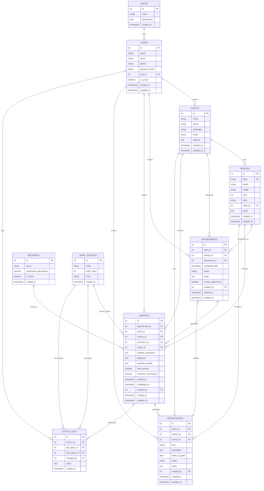

# Especificación Técnica Completa - App Henry Diagnostics

## 1. Información General
- **Nombre del Taller:** Henry Diagnostics
- **Tipo de Sistema:** Aplicación web responsiva para gestión integral de taller mecánico
- **Plataformas:** 
  - Desktop/Tablet: Operación completa del taller
  - Móvil: Consulta de status para propietarios
- **Estado Actual:** Proceso completamente manual

## 2. Flujo de Operaciones Actual

### Proceso Principal:
1. **Cita Telefónica** - Se captura información básica del cliente
2. **Recepción del Vehículo** - Se completan datos y se marca como recibido
3. **Diagnóstico** - Mecánico evalúa el vehículo
4. **Cotización** - Se genera y envía por WhatsApp
5. **Autorización** - Cliente aprueba el trabajo
6. **Proceso de Trabajo** - Ejecución de reparaciones
7. **Finalización y Cobro** - Se termina y cobra el trabajo
8. **Creación de Oportunidades** - Para trabajos futuros/recurrentes (con todos los datos completos)
9. **Seguimiento** - Una semana antes de fecha pactada
10. **Nueva Cita desde Oportunidad** - Con datos pre-cargados, salto directo al paso 2

### Flujos de Citas:
**Flujo A - Cita Nueva (telefónica):**
- Información mínima: cliente, vehículo (marca/modelo), teléfono, fecha
- Al llegar: se completan datos del vehículo (placa) y proceso normal

**Flujo B - Cita desde Oportunidad:**
- Todos los datos ya disponibles (cliente, vehículo completo con placa)
- Al llegar: directo a "Recibido" sin captura adicional de datos
- Referencia a la oportunidad origen

## 3. Módulos del Sistema

### 3.1 Módulo de Usuarios y Roles
- **Administrador:** Gestiona usuarios y asigna roles
- **Recepcionistas:** Toman citas, reciben vehículos, hacen cotizaciones, dan seguimiento
- **Encargado de Taller:** Cobra, crea oportunidades, supervisa proceso
- **Mecánicos:** Realizan diagnósticos y trabajos (no acceso al sistema, pero se registran para comisiones)
- **Propietarios:** Consulta status de sus vehículos (acceso móvil)

### 3.2 Módulo de Citas
**Información inicial capturada:**
- Tipo de vehículo (marca, modelo)
- Nombre del cliente
- Teléfono/WhatsApp
- Fecha y hora de cita (slots flexibles)

### 3.3 Módulo de Clientes
**Información del cliente:**
- Nombre completo
- Teléfono/WhatsApp
- Dirección (opcional)
- Email (opcional)
- Fecha de registro
- Historial de servicios

### 3.4 Módulo de Vehículos
**Información del vehículo:**
- Placa (identificador único)
- Marca
- Modelo
- Año
- Color
- Cliente propietario (relación)
- Historial de servicios
- Notas especiales del vehículo

### 3.5 Módulo de Servicios/Trabajos
**Información del servicio:**
- Cliente
- Vehículo
- Fecha de ingreso
- Descripción del problema/servicio
- Diagnóstico
- Estado actual
- Mecánico asignado
- Monto total del trabajo
- Comisión del mecánico (% configurable)
- Fecha de finalización
- Observaciones
- Relación con oportunidades futuras

### 3.6 Módulo de Búsqueda y Consultas
**Capacidades de búsqueda:**
- Por nombre del cliente
- Por placa del vehículo
- Por marca/modelo del vehículo
- Por teléfono del cliente
- Filtros por fecha de servicio
- Historial completo de servicios por cliente/vehículo

### 3.7 Módulo de Estados de Trabajo
**Estados del vehículo:**
- Recibido
- Cotizado
- Autorizado
- En Proceso
- Terminado

### 3.8 Módulo de Oportunidades
**Tipos de oportunidades:**
- Mantenimiento
- Trabajo Pendiente
- [Otros tipos por definir]

**Características:**
- Fecha pactada para seguimiento
- Seguimiento automático una semana antes
- Creación a criterio del encargado con acuerdo del cliente

### 3.9 Módulo de Comisiones
**Gestión de comisiones para mecánicos:**
- Registro de mecánicos (nombre, porcentaje de comisión)
- Cálculo automático de comisiones por servicio completado
- Reportes de comisiones por mecánico
- Reportes por período (semanal, mensual)
- Estado de pago de comisiones

### 3.10 Módulo Móvil para Propietarios
**Funcionalidades para clientes:**
- Consulta de status de vehículos en proceso
- Historial de servicios de sus vehículos
- Notificaciones de cambios de estado
- Vista simplificada y optimizada para móvil

## 4. Interfaces de Usuario

### 4.1 Desktop/Tablet (Operación Principal)
- Interfaz completa con todos los módulos
- Optimizada para pantallas grandes
- Navegación rápida entre funciones
- Dashboards con métricas clave

### 4.2 Móvil (Propietarios)
- Interfaz simplificada
- Enfoque en consulta de status
- Notificaciones push
- Fácil acceso desde WhatsApp/SMS

## 5. Especificación Técnica

### 5.1 Framework y Stack Tecnológico
**Stack Principal:**
- **Frontend:** React 18+ con TypeScript
- **Backend:** Node.js con Express.js
- **Base de Datos:** PostgreSQL 15+
- **ORM:** Prisma ORM
- **Autenticación:** JWT + bcrypt
- **Build Tool:** Vite (Frontend) + tsc (Backend)
- **Styling:** Tailwind CSS + shadcn/ui components
- **State Management:** Zustand o React Context
- **HTTP Client:** Axios
- **Validación:** Zod (compartido frontend/backend)
- **Testing:** Vitest + React Testing Library
- **Linting:** ESLint + Prettier

**Deployment:**
- **Plataforma:** Railway
- **Arquitectura:** Monolítica (Frontend + Backend en un servicio)
- **Base de Datos:** PostgreSQL service separado en Railway
- **CI/CD:** GitHub integration automático

### 5.2 Estructura de Carpetas del Proyecto

```
henry-diagnostics/
├── prisma/
│   ├── schema.prisma           # Esquema de base de datos
│   └── seed.ts                # Datos iniciales (roles, estados)
├── src/
│   ├── client/                 # Frontend React
│   │   ├── public/
│   │   ├── src/
│   │   │   ├── components/     # Componentes UI
│   │   │   ├── pages/          # Páginas (dashboard, clients, vehicles, etc.)
│   │   │   ├── hooks/          # Custom hooks
│   │   │   ├── stores/         # State management
│   │   │   ├── utils/          # Utilidades
│   │   │   ├── types/          # Tipos TypeScript
│   │   │   ├── App.tsx
│   │   │   └── main.tsx
│   │   ├── package.json
│   │   └── vite.config.ts
│   ├── server/                 # Backend Express
│   │   ├── src/
│   │   │   ├── routes/         # Rutas API
│   │   │   ├── controllers/    # Controladores
│   │   │   ├── services/       # Lógica de negocio
│   │   │   ├── middleware/     # Middlewares
│   │   │   ├── utils/          # Utilidades
│   │   │   ├── config/         # Configuraciones
│   │   │   ├── app.ts          # App Express
│   │   │   └── server.ts       # Punto de entrada
│   │   ├── package.json
│   │   └── tsconfig.json
│   └── shared/                 # Código compartido
│       ├── types/              # Tipos compartidos
│       ├── schemas/            # Validaciones Zod
│       ├── constants/          # Constantes
│       └── utils/              # Utilidades compartidas
├── package.json                # Configuración raíz
├── railway.json               # Configuración Railway
├── .env.example
├── .gitignore
└── README.md
```

### 5.3 Diagrama de Relaciones de Base de Datos



### 5.4 Estructura de Base de Datos SQL

```sql
-- Usuarios y Roles
CREATE TABLE roles (
    id SERIAL PRIMARY KEY,
    name VARCHAR(50) NOT NULL UNIQUE,
    permissions JSON,
    created_at TIMESTAMP DEFAULT CURRENT_TIMESTAMP
);

CREATE TABLE users (
    id SERIAL PRIMARY KEY,
    name VARCHAR(100) NOT NULL,
    email VARCHAR(100) UNIQUE,
    phone VARCHAR(20) NOT NULL,
    password_hash VARCHAR(255),
    role_id INTEGER REFERENCES roles(id),
    is_active BOOLEAN DEFAULT true,
    created_at TIMESTAMP DEFAULT CURRENT_TIMESTAMP,
    updated_at TIMESTAMP DEFAULT CURRENT_TIMESTAMP
);

-- Clientes
CREATE TABLE clients (
    id SERIAL PRIMARY KEY,
    name VARCHAR(100) NOT NULL,
    phone VARCHAR(20) NOT NULL,
    whatsapp VARCHAR(20),
    email VARCHAR(100),
    address TEXT,
    created_at TIMESTAMP DEFAULT CURRENT_TIMESTAMP,
    updated_at TIMESTAMP DEFAULT CURRENT_TIMESTAMP
);

-- Vehículos
CREATE TABLE vehicles (
    id SERIAL PRIMARY KEY,
    plate VARCHAR(20) UNIQUE NOT NULL,
    brand VARCHAR(50) NOT NULL,
    model VARCHAR(50) NOT NULL,
    year INTEGER,
    color VARCHAR(30),
    client_id INTEGER REFERENCES clients(id) ON DELETE CASCADE,
    notes TEXT,
    created_at TIMESTAMP DEFAULT CURRENT_TIMESTAMP,
    updated_at TIMESTAMP DEFAULT CURRENT_TIMESTAMP
);

-- Mecánicos
CREATE TABLE mechanics (
    id SERIAL PRIMARY KEY,
    name VARCHAR(100) NOT NULL,
    commission_percentage DECIMAL(5,2) NOT NULL DEFAULT 0.00,
    is_active BOOLEAN DEFAULT true,
    created_at TIMESTAMP DEFAULT CURRENT_TIMESTAMP
);

-- Estados de trabajo
CREATE TABLE work_statuses (
    id SERIAL PRIMARY KEY,
    name VARCHAR(50) NOT NULL,
    order_index INTEGER NOT NULL,
    color VARCHAR(7) DEFAULT '#6B7280', -- Color hex para UI
    created_at TIMESTAMP DEFAULT CURRENT_TIMESTAMP
);

-- Insertar estados por defecto
INSERT INTO work_statuses (name, order_index, color) VALUES 
('Recibido', 1, '#EF4444'),
('Cotizado', 2, '#F59E0B'),
('Autorizado', 3, '#3B82F6'),
('En Proceso', 4, '#8B5CF6'),
('Terminado', 5, '#10B981');

-- Citas
CREATE TABLE appointments (
    id SERIAL PRIMARY KEY,
    client_id INTEGER REFERENCES clients(id),
    vehicle_id INTEGER REFERENCES vehicles(id),
    opportunity_id INTEGER REFERENCES opportunities(id), -- NULL si es cita nueva
    scheduled_date TIMESTAMP NOT NULL,
    status VARCHAR(20) DEFAULT 'scheduled', -- scheduled, confirmed, cancelled, completed
    notes TEXT,
    is_from_opportunity BOOLEAN DEFAULT false,
    created_by INTEGER REFERENCES users(id),
    created_at TIMESTAMP DEFAULT CURRENT_TIMESTAMP,
    updated_at TIMESTAMP DEFAULT CURRENT_TIMESTAMP
);

-- Servicios/Trabajos
CREATE TABLE services (
    id SERIAL PRIMARY KEY,
    appointment_id INTEGER REFERENCES appointments(id),
    client_id INTEGER REFERENCES clients(id) NOT NULL,
    vehicle_id INTEGER REFERENCES vehicles(id) NOT NULL,
    mechanic_id INTEGER REFERENCES mechanics(id),
    status_id INTEGER REFERENCES work_statuses(id) DEFAULT 1,
    problem_description TEXT,
    diagnosis TEXT,
    quotation_details TEXT,
    total_amount DECIMAL(10,2) DEFAULT 0.00,
    mechanic_commission DECIMAL(10,2) DEFAULT 0.00,
    started_at TIMESTAMP,
    completed_at TIMESTAMP,
    created_by INTEGER REFERENCES users(id),
    created_at TIMESTAMP DEFAULT CURRENT_TIMESTAMP,
    updated_at TIMESTAMP DEFAULT CURRENT_TIMESTAMP
);

-- Oportunidades
CREATE TABLE opportunities (
    id SERIAL PRIMARY KEY,
    client_id INTEGER REFERENCES clients(id) NOT NULL,
    vehicle_id INTEGER REFERENCES vehicles(id) NOT NULL,
    service_id INTEGER REFERENCES services(id),
    type VARCHAR(50) NOT NULL, -- 'MANTENIMIENTO', 'TRABAJO_PENDIENTE'
    description TEXT NOT NULL,
    follow_up_date DATE NOT NULL,
    status VARCHAR(20) DEFAULT 'pending', -- pending, contacted, scheduled, closed
    notes TEXT,
    created_by INTEGER REFERENCES users(id),
    created_at TIMESTAMP DEFAULT CURRENT_TIMESTAMP,
    updated_at TIMESTAMP DEFAULT CURRENT_TIMESTAMP
);

-- Logs de cambios de estado
CREATE TABLE status_logs (
    id SERIAL PRIMARY KEY,
    service_id INTEGER REFERENCES services(id) NOT NULL,
    old_status_id INTEGER REFERENCES work_statuses(id),
    new_status_id INTEGER REFERENCES work_statuses(id) NOT NULL,
    changed_by INTEGER REFERENCES users(id),
    notes TEXT,
    created_at TIMESTAMP DEFAULT CURRENT_TIMESTAMP
);

-- Índices para mejorar performance
CREATE INDEX idx_clients_phone ON clients(phone);
CREATE INDEX idx_vehicles_plate ON vehicles(plate);
CREATE INDEX idx_vehicles_client ON vehicles(client_id);
CREATE INDEX idx_services_client ON services(client_id);
CREATE INDEX idx_services_vehicle ON services(vehicle_id);
CREATE INDEX idx_services_status ON services(status_id);
CREATE INDEX idx_appointments_date ON appointments(scheduled_date);
CREATE INDEX idx_opportunities_follow_up ON opportunities(follow_up_date);
```

### 5.5 API Endpoints

#### Autenticación
```
POST /api/auth/login          # Login con email/phone y password
POST /api/auth/logout         # Logout
GET  /api/auth/me            # Obtener usuario actual
POST /api/auth/refresh       # Refresh token
```

#### Usuarios y Roles
```
GET    /api/users            # Listar usuarios (admin)
POST   /api/users            # Crear usuario (admin)
GET    /api/users/:id        # Obtener usuario
PUT    /api/users/:id        # Actualizar usuario
DELETE /api/users/:id        # Eliminar usuario (admin)
GET    /api/roles            # Listar roles disponibles
```

#### Clientes
```
GET    /api/clients                    # Listar clientes
POST   /api/clients                    # Crear cliente
GET    /api/clients/:id                # Obtener cliente
PUT    /api/clients/:id                # Actualizar cliente
DELETE /api/clients/:id                # Eliminar cliente
GET    /api/clients/search?q={query}   # Buscar clientes
```

#### Vehículos
```
GET    /api/vehicles                      # Listar vehículos
POST   /api/vehicles                      # Crear vehículo
GET    /api/vehicles/:id                  # Obtener vehículo
PUT    /api/vehicles/:id                  # Actualizar vehículo
DELETE /api/vehicles/:id                  # Eliminar vehículo
GET    /api/vehicles/search?q={query}     # Buscar vehículos
GET    /api/vehicles/client/:clientId     # Vehículos de un cliente
GET    /api/vehicles/:id/history          # Historial de servicios
```

#### Citas
```
GET    /api/appointments                    # Listar citas
POST   /api/appointments                    # Crear cita (nueva o desde oportunidad)
POST   /api/appointments/from-opportunity   # Crear cita específicamente desde oportunidad
GET    /api/appointments/:id                # Obtener cita
PUT    /api/appointments/:id                # Actualizar cita
DELETE /api/appointments/:id                # Cancelar cita
GET    /api/appointments/date/:date         # Citas por fecha
GET    /api/appointments/calendar           # Vista calendario
```

#### Servicios
```
GET    /api/services                      # Listar servicios
POST   /api/services                      # Crear servicio
GET    /api/services/:id                  # Obtener servicio
PUT    /api/services/:id                  # Actualizar servicio
PUT    /api/services/:id/status           # Cambiar estado
DELETE /api/services/:id                  # Eliminar servicio
GET    /api/services/vehicle/:vehicleId   # Servicios por vehículo
GET    /api/services/client/:clientId     # Servicios por cliente
GET    /api/services/mechanic/:mechanicId # Servicios por mecánico
```

#### Oportunidades
```
GET    /api/opportunities                 # Listar oportunidades
POST   /api/opportunities                 # Crear oportunidad
GET    /api/opportunities/:id             # Obtener oportunidad
PUT    /api/opportunities/:id             # Actualizar oportunidad
DELETE /api/opportunities/:id             # Eliminar oportunidad
GET    /api/opportunities/due             # Oportunidades próximas
PUT    /api/opportunities/:id/schedule    # Convertir oportunidad en cita
```

#### Mecánicos y Comisiones
```
GET    /api/mechanics                     # Listar mecánicos
POST   /api/mechanics                     # Crear mecánico
GET    /api/mechanics/:id                 # Obtener mecánico
PUT    /api/mechanics/:id                 # Actualizar mecánico
GET    /api/mechanics/:id/commissions     # Comisiones por mecánico
GET    /api/reports/commissions           # Reporte de comisiones
```

#### Dashboard y Reportes
```
GET    /api/dashboard/summary             # Resumen del dashboard
GET    /api/reports/daily                 # Reporte diario
GET    /api/reports/monthly               # Reporte mensual
GET    /api/reports/services              # Reporte de servicios
```

#### API Móvil (Propietarios)
```
POST   /api/mobile/auth                   # Login móvil con teléfono
GET    /api/mobile/vehicles/:phone        # Vehículos del propietario
GET    /api/mobile/services/:vehicleId    # Servicios de un vehículo
```

### 5.6 Características Técnicas Específicas

#### Búsqueda
- Implementar búsqueda full-text en PostgreSQL usando `ILIKE` y `ts_vector`
- Índices en campos frecuentemente consultados (plate, phone, name)
- Búsqueda unificada que incluya clientes, vehículos y servicios
- Filtros avanzados por fecha, estado, mecánico

#### Autenticación y Seguridad
- JWT con refresh tokens (7 días access, 30 días refresh)
- Bcrypt para hash de passwords (salt rounds: 12)
- Rate limiting en APIs (100 requests/15min por IP)
- Validación de datos con Zod
- Sanitización de inputs
- CORS configurado correctamente

#### Estados y Workflow
- Validación de transiciones de estado (no saltar estados)
- Logs automáticos de cambios de estado
- Timestamps automáticos en cada transición
- Notificaciones en tiempo real con WebSocket

#### Performance
- Paginación en listados (20 items por página)
- Lazy loading en frontend
- Optimización de queries con JOIN apropiados
- Compresión gzip en respuestas
- Caché de consultas frecuentes

#### Notificaciones
- WebSocket para actualizaciones en tiempo real
- Sistema de notificaciones push para móvil
- Integración futura con WhatsApp API
- Emails automáticos para recordatorios

### 5.7 Configuración Railway Específica

#### Configuración del Proyecto Railway
```yaml
# railway.json
{
  "build": {
    "builder": "NIXPACKS",
    "buildCommand": "npm run build"
  },
  "deploy": {
    "startCommand": "npm start",
    "restartPolicyType": "ON_FAILURE",
    "restartPolicyMaxRetries": 10
  },
  "healthcheckPath": "/api/health",
  "healthcheckTimeout": 100,
  "environmentVariables": {
    "NODE_ENV": "production"
  }
}
```

#### Scripts package.json (Raíz)
```json
{
  "name": "henry-diagnostics",
  "version": "1.0.0",
  "scripts": {
    "build": "npm run build:client && npm run build:server",
    "build:client": "cd src/client && npm install && npm run build",
    "build:server": "cd src/server && npm install && npm run build",
    "start": "cd src/server && npm start",
    "dev": "concurrently \"npm run dev:server\" \"npm run dev:client\"",
    "dev:server": "cd src/server && npm run dev",
    "dev:client": "cd src/client && npm run dev",
    "postinstall": "cd src/server && npm install && npx prisma generate && npx prisma migrate deploy"
  },
  "dependencies": {
    "concurrently": "^8.2.0"
  }
}
```

#### Variables de Entorno Railway
```env
# Automáticamente proporcionadas por Railway
DATABASE_URL=postgresql://postgres:[password]@[host]:[port]/railway

# Configurar manualmente en Railway Dashboard
NODE_ENV=production
PORT=3000
JWT_SECRET=your_super_secret_jwt_key_here_min_32_chars
JWT_REFRESH_SECRET=your_refresh_secret_here_min_32_chars
JWT_EXPIRES_IN=7d
JWT_REFRESH_EXPIRES_IN=30d

# CORS y Frontend
ALLOWED_ORIGINS=https://your-app.up.railway.app

# Configuraciones opcionales
BCRYPT_SALT_ROUNDS=12
RATE_LIMIT_WINDOW_MS=900000
RATE_LIMIT_MAX_REQUESTS=100

# Para desarrollo futuro
WHATSAPP_API_KEY=
WHATSAPP_API_URL=https://api.whatsapp.business
EMAIL_SERVICE_API_KEY=
```

#### Estructura de Deployment
```
Railway Project: henry-diagnostics
├── Service 1: henry-diagnostics-app (Monolítico)
│   ├── Build: Nixpacks auto-detect
│   ├── Start: npm start
│   ├── Port: 3000
│   ├── Domain: henry-diagnostics.up.railway.app
│   └── Environment Variables: [configuradas arriba]
└── Service 2: PostgreSQL
    ├── Auto-managed PostgreSQL 15
    ├── Automatic backups
    ├── Connection string: $DATABASE_URL
    └── Metrics included
```

#### Prisma Schema (prisma/schema.prisma)
```prisma
generator client {
  provider = "prisma-client-js"
}

datasource db {
  provider = "postgresql"
  url      = env("DATABASE_URL")
}

model Role {
  id          Int      @id @default(autoincrement())
  name        String   @unique
  permissions Json?
  createdAt   DateTime @default(now()) @map("created_at")
  
  users User[]
  
  @@map("roles")
}

model User {
  id           Int      @id @default(autoincrement())
  name         String
  email        String?  @unique
  phone        String
  passwordHash String   @map("password_hash")
  roleId       Int      @map("role_id")
  isActive     Boolean  @default(true) @map("is_active")
  createdAt    DateTime @default(now()) @map("created_at")
  updatedAt    DateTime @updatedAt @map("updated_at")
  
  role Role @relation(fields: [roleId], references: [id])
  
  createdClients       Client[]
  createdAppointments  Appointment[]
  createdServices      Service[]
  createdOpportunities Opportunity[]
  statusLogs           StatusLog[]
  
  @@map("users")
}

model Client {
  id        Int      @id @default(autoincrement())
  name      String
  phone     String
  whatsapp  String?
  email     String?
  address   String?
  createdAt DateTime @default(now()) @map("created_at")
  updatedAt DateTime @updatedAt @map("updated_at")
  
  vehicles      Vehicle[]
  appointments  Appointment[]
  services      Service[]
  opportunities Opportunity[]
  
  @@map("clients")
}

model Vehicle {
  id        Int      @id @default(autoincrement())
  plate     String   @unique
  brand     String
  model     String
  year      Int?
  color     String?
  clientId  Int      @map("client_id")
  notes     String?
  createdAt DateTime @default(now()) @map("created_at")
  updatedAt DateTime @updatedAt @map("updated_at")
  
  client Client @relation(fields: [clientId], references: [id], onDelete: Cascade)
  
  appointments  Appointment[]
  services      Service[]
  opportunities Opportunity[]
  
  @@map("vehicles")
}

model Mechanic {
  id                    Int     @id @default(autoincrement())
  name                  String
  commissionPercentage  Decimal @default(0.00) @map("commission_percentage") @db.Decimal(5, 2)
  isActive              Boolean @default(true) @map("is_active")
  createdAt             DateTime @default(now()) @map("created_at")
  
  services Service[]
  
  @@map("mechanics")
}

model WorkStatus {
  id         Int      @id @default(autoincrement())
  name       String
  orderIndex Int      @map("order_index")
  color      String   @default("#6B7280")
  createdAt  DateTime @default(now()) @map("created_at")
  
  services         Service[]
  oldStatusLogs    StatusLog[] @relation("OldStatus")
  newStatusLogs    StatusLog[] @relation("NewStatus")
  
  @@map("work_statuses")
}

model Appointment {
  id                 Int       @id @default(autoincrement())
  clientId           Int       @map("client_id")
  vehicleId          Int       @map("vehicle_id")
  opportunityId      Int?      @map("opportunity_id")
  scheduledDate      DateTime  @map("scheduled_date")
  status             String    @default("scheduled")
  notes              String?
  isFromOpportunity  Boolean   @default(false) @map("is_from_opportunity")
  createdBy          Int       @map("created_by")
  createdAt          DateTime  @default(now()) @map("created_at")
  updatedAt          DateTime  @updatedAt @map("updated_at")
  
  client      Client       @relation(fields: [clientId], references: [id])
  vehicle     Vehicle      @relation(fields: [vehicleId], references: [id])
  opportunity Opportunity? @relation(fields: [opportunityId], references: [id])
  createdByUser User       @relation(fields: [createdBy], references: [id])
  
  services Service[]
  
  @@map("appointments")
}

model Service {
  id                  Int       @id @default(autoincrement())
  appointmentId       Int?      @map("appointment_id")
  clientId            Int       @map("client_id")
  vehicleId           Int       @map("vehicle_id")
  mechanicId          Int?      @map("mechanic_id")
  statusId            Int       @default(1) @map("status_id")
  problemDescription  String?   @map("problem_description")
  diagnosis           String?
  quotationDetails    String?   @map("quotation_details")
  totalAmount         Decimal   @default(0.00) @map("total_amount") @db.Decimal(10, 2)
  mechanicCommission  Decimal   @default(0.00) @map("mechanic_commission") @db.Decimal(10, 2)
  startedAt           DateTime? @map("started_at")
  completedAt         DateTime? @map("completed_at")
  createdBy           Int       @map("created_by")
  createdAt           DateTime  @default(now()) @map("created_at")
  updatedAt           DateTime  @updatedAt @map("updated_at")
  
  appointment   Appointment? @relation(fields: [appointmentId], references: [id])
  client        Client       @relation(fields: [clientId], references: [id])
  vehicle       Vehicle      @relation(fields: [vehicleId], references: [id])
  mechanic      Mechanic?    @relation(fields: [mechanicId], references: [id])
  status        WorkStatus   @relation(fields: [statusId], references: [id])
  createdByUser User         @relation(fields: [createdBy], references: [id])
  
  opportunities Opportunity[]
  statusLogs    StatusLog[]
  
  @@map("services")
}

model Opportunity {
  id           Int      @id @default(autoincrement())
  clientId     Int      @map("client_id")
  vehicleId    Int      @map("vehicle_id")
  serviceId    Int?     @map("service_id")
  type         String
  description  String
  followUpDate DateTime @map("follow_up_date") @db.Date
  status       String   @default("pending")
  notes        String?
  createdBy    Int      @map("created_by")
  createdAt    DateTime @default(now()) @map("created_at")
  updatedAt    DateTime @updatedAt @map("updated_at")
  
  client        Client    @relation(fields: [clientId], references: [id])
  vehicle       Vehicle   @relation(fields: [vehicleId], references: [id])
  service       Service?  @relation(fields: [serviceId], references: [id])
  createdByUser User      @relation(fields: [createdBy], references: [id])
  
  appointments Appointment[]
  
  @@map("opportunities")
}

model StatusLog {
  id           Int      @id @default(autoincrement())
  serviceId    Int      @map("service_id")
  oldStatusId  Int?     @map("old_status_id")
  newStatusId  Int      @map("new_status_id")
  changedBy    Int      @map("changed_by")
  notes        String?
  createdAt    DateTime @default(now()) @map("created_at")
  
  service       Service     @relation(fields: [serviceId], references: [id])
  oldStatus     WorkStatus? @relation("OldStatus", fields: [oldStatusId], references: [id])
  newStatus     WorkStatus  @relation("NewStatus", fields: [newStatusId], references: [id])
  changedByUser User        @relation(fields: [changedBy], references: [id])
  
  @@map("status_logs")
}
```

## 6. Funcionalidades Específicas

### 6.1 Gestión de Citas
- **Citas Nuevas (telefónicas):**
  - Información mínima: cliente, vehículo (marca/modelo), teléfono, fecha/hora
  - Al llegar el vehículo: completar placa y datos faltantes
- **Citas desde Oportunidades:**
  - Todos los datos pre-cargados (cliente completo + vehículo con placa)
  - Referencia a la oportunidad origen
  - Al llegar: directo a estado "Recibido"
- Calendario visual con slots disponibles
- Validación de disponibilidad antes de agendar
- Reagendamiento y cancelación de citas
- Notificaciones de recordatorio

### 6.2 Flujo de Estados
- Transición secuencial obligatoria: Recibido → Cotizado → Autorizado → En Proceso → Terminado
- Validaciones de negocio (no saltar estados)
- Timestamps automáticos en cada cambio
- Logs de auditoría de cambios
- Notificaciones automáticas a propietarios en cambios críticos

### 6.3 Dashboard Principal
- Resumen del día: citas programadas, trabajos en proceso, servicios completados
- Alertas visuales para trabajos retrasados
- Métricas rápidas: ingresos del día, servicios por estado
- Oportunidades próximas a vencer (próximos 7 días)
- Lista de tareas pendientes

### 6.4 Sistema de Búsqueda Unificada
- Búsqueda global: clientes, vehículos, placas, teléfonos
- Filtros avanzados: por fecha, estado, mecánico
- Búsqueda difusa para tolerancia a errores tipográficos
- Resultados agrupados por tipo (clientes, vehículos, servicios)
- Historial de búsquedas recientes

### 6.5 Gestión de Oportunidades
- Creación manual por encargado después de servicio completado
- **Datos completos disponibles:** toda la información del cliente y vehículo
- Tipos: Mantenimiento Preventivo, Trabajo Pendiente, Otros
- Algoritmo de seguimiento: alertas 7 días antes de fecha programada
- Estados: Pendiente, Contactado, Agendado, Cerrado
- **Conversión a cita:** 
  - Botón "Agendar Cita" desde la oportunidad
  - Datos pre-cargados automáticamente
  - Flujo simplificado sin re-captura de información
  - Referencia bidireccional entre oportunidad y cita resultante

### 6.6 App Móvil para Propietarios
- Login simplificado: teléfono + PIN enviado por SMS
- Vista de vehículos del propietario
- Estado actual de servicios en progreso
- Historial completo de servicios por vehículo
- Notificaciones push para cambios de estado importantes
- Interfaz optimizada para pantallas pequeñas

### 6.7 Sistema de Comisiones
- Registro de mecánicos con porcentaje personalizado
- Cálculo automático al completar servicio
- Reportes de comisiones por mecánico y período
- Estado de pagos (pendiente, pagado)
- Exportación de reportes a PDF/Excel

### 6.8 Gestión de Clientes y Vehículos
- Un cliente puede tener múltiples vehículos
- Historial completo de servicios por cliente/vehículo
- Notas especiales por vehículo
- Datos de contacto múltiples (teléfono, WhatsApp, email)
- Merge de clientes duplicados

## 7. Interfaces de Usuario

### 7.1 Desktop/Tablet (Operación Principal)
- Sidebar con navegación principal
- Dashboard con widgets personalizables
- Tablas con paginación, ordenamiento y filtros
- Modales para formularios de creación/edición
- Notificaciones toast para feedback
- Tema claro/oscuro

### 7.2 Móvil (Propietarios)
- Bottom navigation para funciones principales
- Cards para mostrar vehículos y servicios
- Timeline para seguimiento de estados
- Pull-to-refresh para actualizar datos
- Notificaciones push nativas

## 8. Fases de Desarrollo Sugeridas

### Fase 1 - Core (MVP) - 2-3 semanas
- Setup Railway monolítico + PostgreSQL
- Autenticación y sistema de usuarios/roles
- CRUD básico: clientes, vehículos, mecánicos
- Sistema de citas básico
- Estados de trabajo (sin transiciones automáticas)
- Dashboard básico

### Fase 2 - Operaciones - 2-3 semanas
- Gestión completa de servicios con workflow
- Sistema de transiciones de estado
- Búsqueda unificada
- Sistema de oportunidades
- Logs de auditoría
- Dashboard avanzado con métricas

### Fase 3 - Avanzado - 3-4 semanas
- App móvil para propietarios
- Sistema de comisiones para mecánicos
- Reportes y exportación (PDF/Excel)
- Notificaciones en tiempo real (WebSocket)
- Sistema de notificaciones push

### Fase 4 - Optimización - 2-3 semanas
- Integración WhatsApp API
- Optimizaciones de performance
- Funciones avanzadas basadas en feedback
- Tests automatizados
- Documentación completa

## 9. Consideraciones Adicionales

### 9.1 Backup y Recuperación
- Backups automáticos diarios en Railway
- Export manual de datos críticos
- Procedimientos de recuperación documentados

### 9.2 Monitoreo
- Logs centralizados en Railway
- Monitoreo de performance con métricas integradas
- Alertas por email para errores críticos
- Health checks automáticos

### 9.3 Escalabilidad
- Arquitectura preparada para crecimiento
- Índices de base de datos optimizados
- Paginación en todas las listas
- Lazy loading para mejor UX

### 9.4 Seguridad
- Validación exhaustiva de inputs
- Protección contra SQL injection (usando ORM)
- Rate limiting para prevenir ataques
- Logs de seguridad para auditoría

---
*Especificación técnica completa - Henry Diagnostics v1.0*
*Deployment: Monolítico en Railway + PostgreSQL*
*Stack: React + Node.js + TypeScript + Prisma*
*Preparada para implementación con Claude Code*